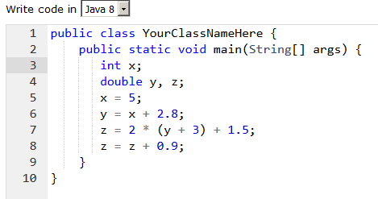
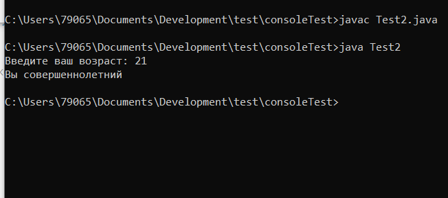

### Задание 1
Hello world
- элемент списка 1
- элемент списка 2

```java
public class Main {
    public static void main(String[] args) {
        System.out.println("Hello world");
    }
}
```
[Ссылка](Test1.md)



### Задание 2
```java
public class Test2 {
    public static void main(String[] args) {
        Scanner scanner = new Scanner(System.in);
        System.out.print("Введите ваш возраст: ");
        if (scanner.nextInt() < 18) {
            System.out.println("Вы несовершеннолетний");
        } else {
            System.out.println("Вы совершеннолетний");
        }
    }
}
```
